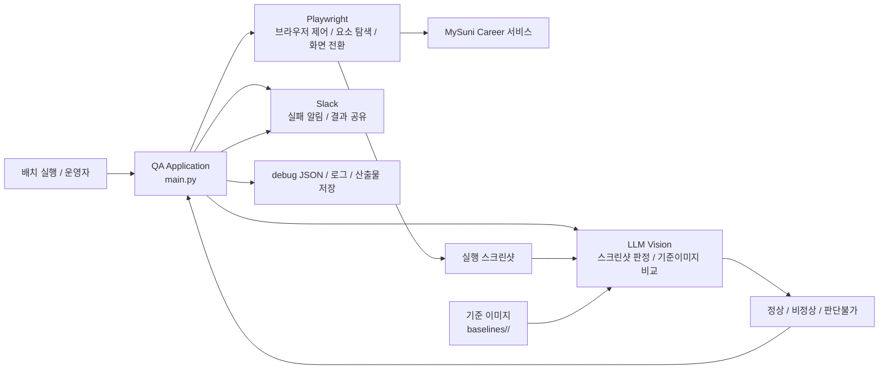
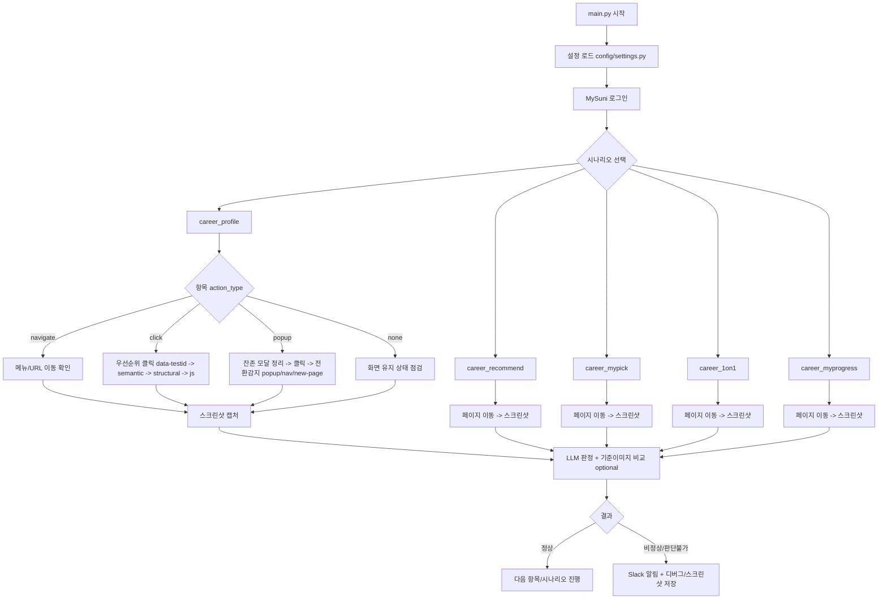
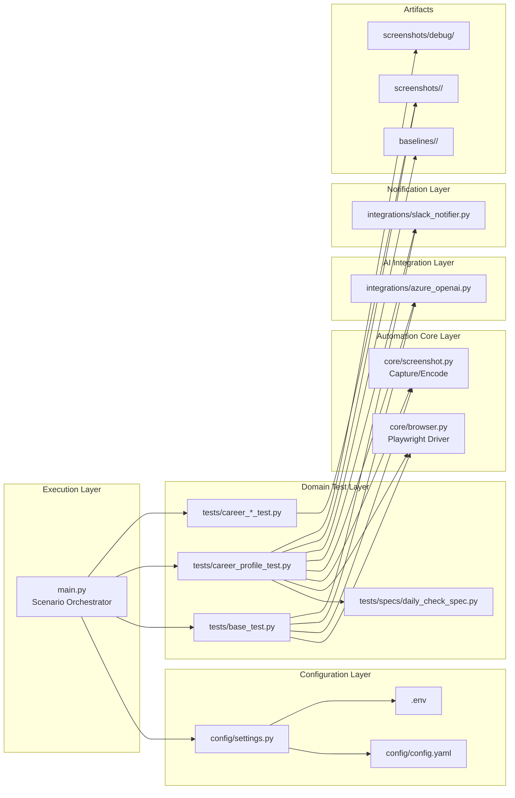

# Architecture And Service Flows

이 문서는 점검항목 유형별 서비스 흐름과 애플리케이션 아키텍처를 정리합니다.

## 서비스 구조(역할 중심) : Playwright + LLM + Slack

| 구성 요소 | 주요 역할 | 입력 | 출력 |
| --- | --- | --- | --- |
| QA Application | 실행 제어, 시나리오 선택, 결과 종합 | 설정값, 체크리스트, 환경변수 | 실행 흐름 제어, 최종 결과 |
| Playwright | 로그인, 페이지 이동, 요소 식별, 클릭, 팝업 전환 감지, 스크린샷 캡처 | URL, selector, action_type | 브라우저 상태, 캡처 이미지 |
| LLM Vision | 실행 이미지 판정, 기준 이미지 비교, 정상/비정상 판단 | 실행 스크린샷, 기준 이미지, 프롬프트 | 판정 결과, 상세 응답 |
| Slack | 실패 결과 및 운영 알림 전달 | 시나리오 결과, 스크린샷, 메시지 | DM/채널 알림 |
| Baselines | 기준 화면 관리 | 서비스별 기준 이미지 | LLM 비교 기준 |
| Screenshots / Debug | 실행 증적 및 디버그 분석 자료 저장 | 실행 중 캡처/전환 정보 | PNG, JSON, 로그 |

## 점검항목 유형별 서비스 흐름도

## 애플리케이션 아키텍처도

