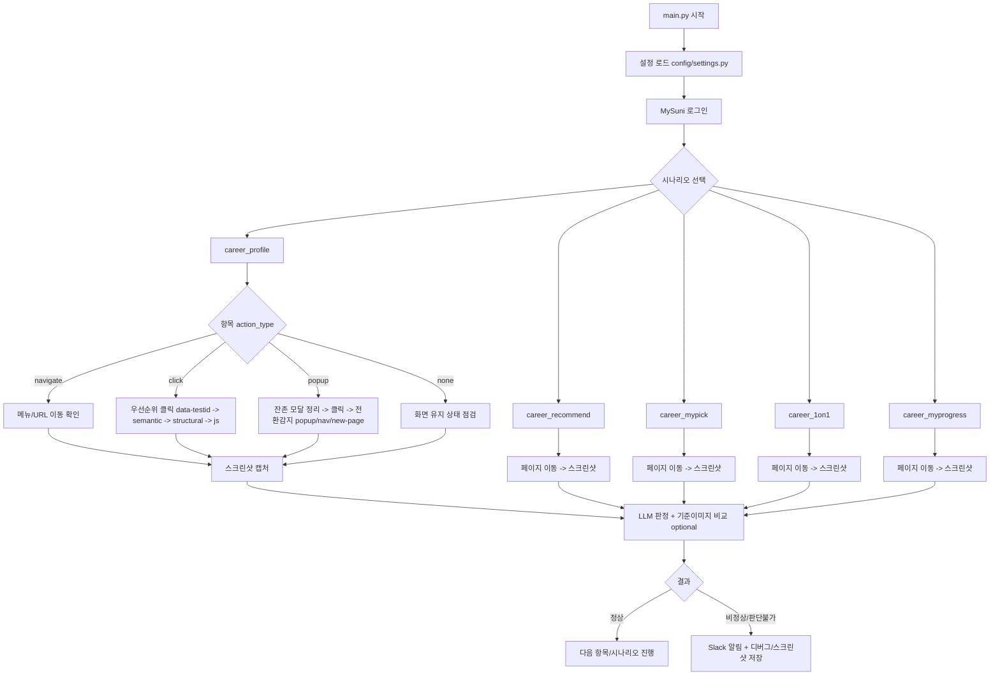
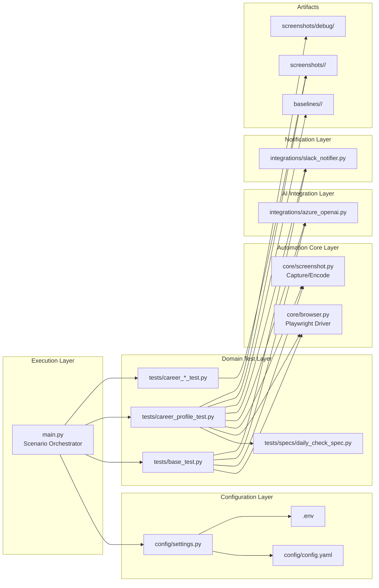

# Architecture And Service Flows

이 문서는 점검항목 유형별 서비스 흐름과 애플리케이션 아키텍처를 정리합니다.

## 점검항목 유형별 서비스 흐름도

```mermaid
flowchart TD
  A[main.py 시작] --> B[설정 로드 config/settings.py]
  B --> C[MySuni 로그인]
  C --> D{시나리오 선택}

  D --> P[career_profile]
  D --> R[career_recommend]
  D --> M[career_mypick]
  D --> O[career_1on1]
  D --> G[career_myprogress]

  P --> P0{항목 action_type}
  P0 -->|navigate| P1[메뉴/URL 이동 확인]
  P0 -->|click| P2[우선순위 클릭 data-testid -> semantic -> structural -> js]
  P0 -->|popup| P3[잔존 모달 정리 -> 클릭 -> 전환감지 popup/nav/new-page]
  P0 -->|none| P4[화면 유지 상태 점검]

  P1 --> P5[스크린샷 캡처]
  P2 --> P5
  P3 --> P5
  P4 --> P5

  R --> R1[페이지 이동 -> 스크린샷]
  M --> M1[페이지 이동 -> 스크린샷]
  O --> O1[페이지 이동 -> 스크린샷]
  G --> G1[페이지 이동 -> 스크린샷]

  P5 --> V[LLM 판정 + 기준이미지 비교 optional]
  R1 --> V
  M1 --> V
  O1 --> V
  G1 --> V

  V --> Z{결과}
  Z -->|정상| S1[다음 항목/시나리오 진행]
  Z -->|비정상/판단불가| S2[Slack 알림 + 디버그/스크린샷 저장]
```

## 애플리케이션 아키텍처도

```mermaid
flowchart LR
  subgraph Runner[Execution Layer]
    MAIN[main.py\nScenario Orchestrator]
  end

  subgraph Config[Configuration Layer]
    YAML[config/config.yaml]
    ENV[.env]
    SETTINGS[config/settings.py]
  end

  subgraph Test[Domain Test Layer]
    BASE[tests/base_test.py]
    PROFILE[tests/career_profile_test.py]
    OTHERS[tests/career_*_test.py]
    SPEC[tests/specs/daily_check_spec.py]
  end

  subgraph Core[Automation Core Layer]
    BROWSER[core/browser.py\nPlaywright Driver]
    SHOT[core/screenshot.py\nCapture/Encode]
  end

  subgraph AI[AI Integration Layer]
    VISION[integrations/azure_openai.py]
  end

  subgraph Notify[Notification Layer]
    SLACK[integrations/slack_notifier.py]
  end

  subgraph Artifacts[Artifacts]
    BASELINE[baselines/<service>/]
    SCREEN[screenshots/<service>/]
    DEBUG[screenshots/debug/]
  end

  MAIN --> SETTINGS
  SETTINGS --> YAML
  SETTINGS --> ENV

  MAIN --> BASE
  MAIN --> PROFILE
  MAIN --> OTHERS
  PROFILE --> SPEC

  BASE --> BROWSER
  BASE --> SHOT
  PROFILE --> BROWSER
  PROFILE --> SHOT

  BASE --> VISION
  PROFILE --> VISION

  BASE --> SLACK
  PROFILE --> SLACK

  PROFILE --> BASELINE
  PROFILE --> SCREEN
  PROFILE --> DEBUG
  OTHERS --> SCREEN
```
